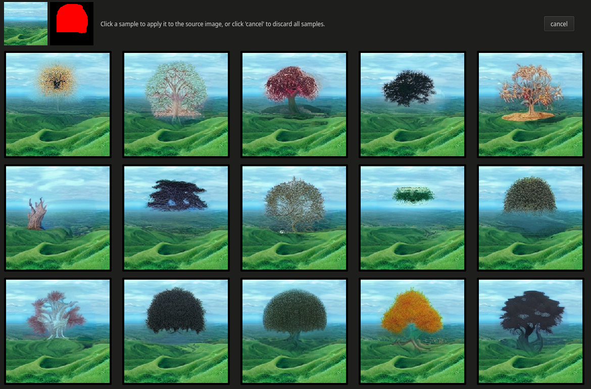
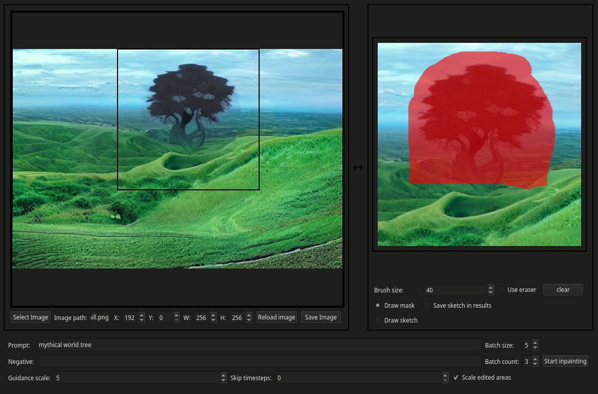
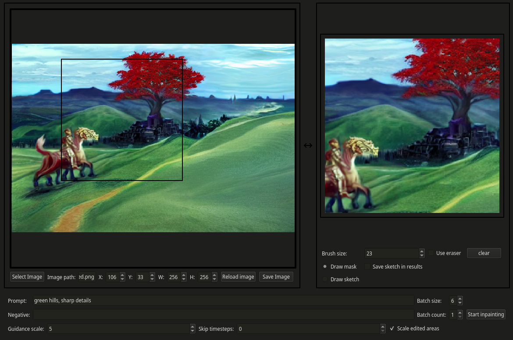

# IntraPaint

Collaborate with AI to make art.

|  | 
|:--:| 
| *1. Draw over the area you want to change, provide a text prompt for guidance* |

|  | 
|:--:| 
| *2. Generate options, pick the one you like best* |

|  | 
|:--:| 
| *3. Your choice is inserted into the image* |

|  | 
|:--:| 
| *4. Repeat.* |

## Background:

IntraPaint provides two main components: an image-generation server, and a client-side editor. The image-generation server uses [GLID-3-XL](https://github.com/Jack000/glid-3-xl) for prompt-guided inpainting, and it is also fully compatible with the fine-tuned [Ongo and Erlich models from LAION-AI](https://github.com/LAION-AI/ldm-finetune). It's designed so that it can run within free GPU instances of Google Colab, so any PC with an internet connection can run IntraPaint. 

The user interface is a desktop application built with PyQt5, designed to simplify the process of repeatedly editing details within larger images using AI-generated results. By guiding the AI image generation process, you can quickly create complex works of art, maintaining creative control. Unlike other AI image generators, there is no uncertainty as to who owns the results of this process: anything you create using IntraPaint is 100% yours.

At the current rate of advancement in machine learning, the image-generation capabilities of GLID-3-XL are unlikely to remain the best free option for this kind of editing for long. With this in mind, I've taken care to decouple the interface and the image generation as much as possible. When new and better systems are available, it should be easy to adapt this interface to work with them.

## Setup

The most basic way to run IntraPaint is to start the server in Google Colab, then connect with it from a pre-bundled instance of the client. 

1. [Open the IntraPaint Server notebook in Google Colab](https://colab.research.google.com/github/centuryglass/IntraPaint/blob/colab-refactor/colabFiles/IntraPaint_colab_server.ipynb). 
2. Follow instructions in the notebook to connect a free ngrok account, start the server, and get the server address. Most functionality will work in Colab's free GPU instances, but CLIP guidance (untested!) requires more GPU memory.
3. Download and launch the latest version of the client (TODO: Linux, Windows, Mac download links).
4. When prompted, enter the server address into the IntraPaint client window.

At the moment, the server only supports a single client. Multiple client support will likely be added, but won't scale well without significant changes and a very powerful GPU.

## Running from source:
All scripts support multiple command-line options, and will describe those options if you run them with `--help`.

### Running the client:
```
pip install pyqt5 requests pillow
python IntraPaint_client.py
```

#### Running the server:
To run the server, you'll need a CUDA-capable GPU with around 10GB of memory. I've been using a RTX 3080.

1. Start by following the [GLID-3-XL documentation](./GLID-3-XL-DOC.md) to install the required dependencies and download pretrained models. To confirm that this step is completed correctly, run `python quickEdit.py --edit examples/edit.png --mask examples/mask.png --prefix test`, and make sure it successfully generates an image at *output/test00000.png*.
2. Install additional dependencies needed to run the server with `pip install flask flask_cors`.
3. Start the server using `python IntraPaint_server.py --port 5555`, and the server's local address will be printed in the console output once it finishes starting.

#### Run as a single application:
Once you've followed the steps for setting up both the client and server, you can run both together using `python IntraPaint_unified.py` In this mode the two components will communicate directly instead of through HTTP requests, so performance is slightly better.

#### Tips:
- Larger edit areas lose details due to scaling, best results are at 256x256 or smaller.
- Non-square edit areas tend to produce worse results than square areas.
- The AI can only see the section of the image that's currently in the editing area. If you're trying to get it to extend or match other parts of your image, make sure they're in that area.
- Using the "draw sketch" option, you can draw directly into the selected area on the right side of the screen to provide additional visual guidance to the AI. This can make it much easier to influence what features it emphasizes and what colors it uses. 

#### Original GLID-3-XL command-line functionality:
All functionality is still available, although some features are untested. I've created a [colab notebook](https://colab.research.google.com/github/centuryglass/IntraPaint/blob/colab-refactor/colabFiles/GLID_3_XL_testing.ipynb) you can use to test these. Scripts have been divided up into separate files. Examples below provide minimal valid commands, but all command line options from the original are still present. Follow [GLID-3-XL documentation](./GLID-3-XL-DOC.md) first to set up dependencies and download models.

- Image generation: `python generate.py --text "Your prompt here"
- Single inpainting operations: `python quickEdit.py --edit "path/to/edited/image" --text "Your prompt here"`
